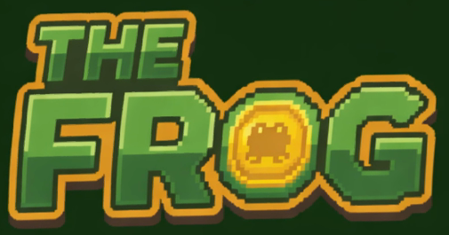
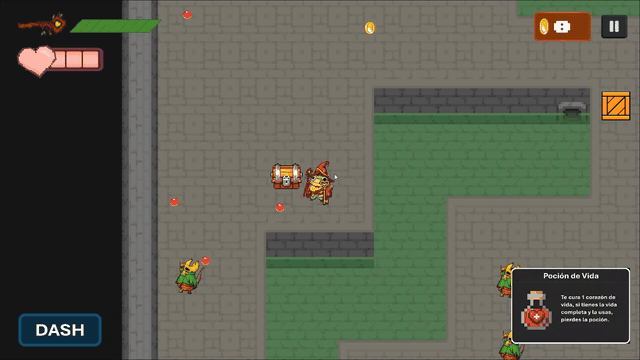
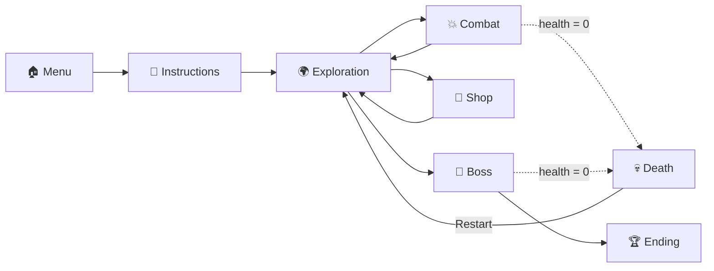

<div align="center">



### A wizard frog, a magic staff, and a rabbit boss who fires more bullets than you can dodge.


</div>

---

## 🎬 Demo

<p align="center">
  <a href="docs/media/gameplay.mp4">
    
  </a>
  <br/>
  <sub>▶️ <a href="docs/media/gameplay.mp4"><b>Watch the full video</b></a> (1:12 min)</sub>
</p>

---

## 📖 About the project

**The Frog** is a *vertical slice* of a 2D action and exploration game with bullet-hell elements. You control a magic frog who explores dungeons, smashes crates, opens chests, dodges with dashes and shoots with her staff on the way to the final boss.

The slice has one clear goal: **to validate the core mechanics, the code architecture and the art pipeline** before scaling up to a full game.

<p align="center">
  
</p>

## ✨ Features

| | Mechanic | What it does |
|---|---|---|
| 🐸 | **Movement and dash** | Smooth movement with a dash that grants invulnerability while dodging. |
| 🔥 | **Ranged combat** | Projectiles fired toward the mouse that spend charges and recharge over time. |
| ❤️ | **Health and knockback** | 3 hearts, knockback on hit and temporary invulnerability. |
| 🧪 | **Potion inventory** | 3 slots with its own UI: health potion and charge potion. |
| 👹 | **Distinct enemies** | Melee, ranged and a 3-phase boss. |
| 🪙 | **Coins and shop** | Collect coins and spend them on upgrades. |
| 🗝️ | **Exploration** | Crates, chests with weighted drops, keys and doors. |
| 🗺️ | **Tilemap levels** | Rooms built with 2D Tilemaps. |
| 🎵 | **Dynamic audio** | Music switches when you enter the boss fight. |

## 🎮 Controls

| Action | Keyboard and mouse | Gamepad |
|---|---|---|
| Move | `W` `A` `S` `D` / arrow keys | Left stick |
| Shoot | `Left click` | `X` / West |
| Dash | `Space` | `A` / South |
| Interact (chests, shop) | `E` | `Y` / North |
| Select potion | `1` `2` `3` | — |
| Use potion | `F` | — |

## 🧪 Potions

<p align="center">
  
  &nbsp;&nbsp;
  
</p>

- **Health Potion:** heals 1 heart. Great for surviving long fights.
- **Charge Potion:** permanently raises the maximum number of bullets by 1. Great for not running out of ammo mid-boss.

## 👾 Enemies

<p align="center">
  
  
  
</p>

| Enemy | Behavior |
|---|---|
| **Light** (`EnemigoLigero`) | Chases the player and attacks in melee. |
| **Ranged** (`EnemigoRango`) | Keeps its distance and shoots when it has line of sight. |
| **Boss** (`EnemigoBoss`) | Orbs that make it invulnerable, a rush attack and 3 bullet-hell phases (circles, cones, spirals and walls). |

## 🔄 Game flow



1. **Menu and tutorial:** the first time you play, `GameManager` pauses the game and shows the instructions.
2. **Exploration:** smash crates, open chests, collect coins and potions, and grab the key for the door.
3. **Combat:** projectiles deal damage through `IRecibeImpactoRetroceso`; enemies drop coins when they die.
4. **Boss:** when it spots you, the music changes. Destroy all the orbs to be able to damage it.
5. **Death and pause:** dying restarts the level (score and inventory included); `PauseMenu` freezes time and input.
6. **Scene change:** `CambioEscena` asks for confirmation before loading the next level.
7. **Ending:** `PantallaFinal` closes the slice.

## 🏗️ Architecture

The project uses Unity's component model but avoids giant scripts: **one responsibility per script** and one folder per type, so you always know where to look when something breaks.

| Category | Scripts |
|---|---|
| 🐸 **Player** | `Movimiento`, `PlayerDisparo`, `VidaPlayer`, `Animacion`, `Inventario` |
| 👾 **Enemies** | `EnemigoBase`, `EnemigoLigero`, `EnemigoRango`, `EnemigoBoss`, `Orbes` |
| ⚙️ **Systems** | `GameManager`, `AudioManager`, `ScoreManager`, `InventarioManager`, `PauseMenu`, `BotonReiniciar` |
| 📦 **Objects** | `Caja`, `Cofre`, `Llave`, `Puerta`, `PocionVida`, `PocionCarga`, `Proyectil` |
| 🖥️ **UI** | `BalaGestor`, `DashGestor`, `Score`, `Mercado`, `Instrucciones`, `PantallaFinal` |
| 🔌 **Interfaces** | `IRecibeImpacto`, `IRecibeImpactoRetroceso` |
| 🎥 **Scenes and camera** | `CambioEscena`, `SeguimientoCamara`, `GuiaMenu`, `PanelAjustes` |

**Design decisions**

- **Decoupled damage:** everything that can take damage implements `IRecibeImpactoRetroceso`, which receives the damage amount and the hit's origin. The origin is used to compute knockback in the right direction.
- **Distributed UI:** each element draws itself from its own script (`BalaGestor`, `DashGestor`, `Score`...) instead of a single `UIManager`.
- **Persistence across scenes:** `InventarioManager` and `ScoreManager` keep what you bought or picked up for the next level.
- **Centralized audio:** `AudioManager` is a singleton that switches between normal and boss music, and exposes `PlaySFX`.

<p align="center">
  
  
  
  
  
</p>

## 🛠️ Tech stack

- **Engine:** Unity 6 (`6000.2.6f1`) with Universal Render Pipeline
- **Language:** C#
- **Input:** Input System
- **UI:** TextMeshPro
- **Levels:** 2D Tilemap
- **Testing:** Unity Test Framework (EditMode and PlayMode)
- **CI:** GitHub Actions with `game-ci/unity-test-runner`

## 🚀 Getting started

1. Install **Unity Hub** and editor version **6000.2.6f1**.
2. Clone the repository:
   ```bash
   git clone https://github.com/<username>/<repository>.git
   ```
3. In Unity Hub click **Add → Add project from disk** and select the cloned folder.
4. Open the scene `Assets/Scenes/Tutorial.unity` and press **Play** ▶️.

> The slice's scenes are `Tutorial`, `Mercado` and `NivelFinal`.

## ✅ Tests and continuous integration

Tests live in `Assets/Tests/` and cover, among other things, movement, shooting, player health and the coin counter. The workflow in `.github/workflows/main.yml` runs the **EditMode** and **PlayMode** tests on every `push` and `pull request`, and publishes a per-class summary.

## 📁 Project structure

```plaintext
.
├── .github/workflows/     # CI: automated tests
├── Assets/
│   ├── Audio/             # Music and SFX
│   ├── Font/              # TextMeshPro fonts
│   ├── Prefab/            # Reusable prefabs
│   ├── Scenes/            # Tutorial, Mercado, NivelFinal
│   ├── Scripts/           # C# code
│   ├── Settings/          # URP and global volume
│   ├── Sprites/           # PNG art
│   ├── Tests/             # EditMode and PlayMode
│   └── Tilemap/           # Tilemaps and palettes
├── docs/media/            # Video, GIF and logo used in this README
├── Packages/              # Dependencies
└── ProjectSettings/       # Unity configuration
```

## 👥 Authors

- Rubén García Vilches
- Adam El Fakhouri
- Carlos Sánchez Herrero
- Franco Aldair Sosa Martinez
- Da Wei Wu Chen
